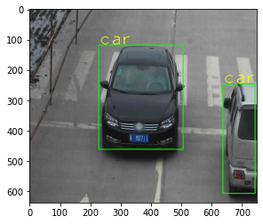
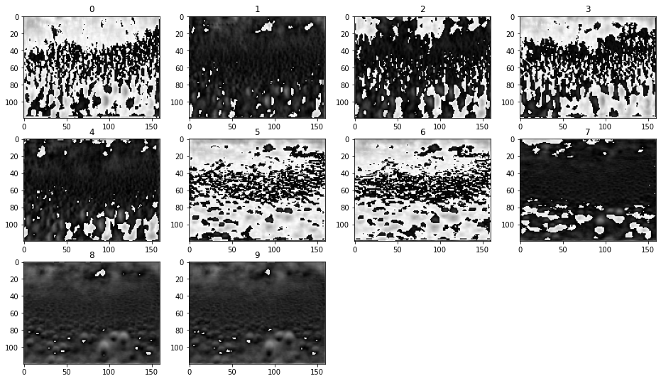
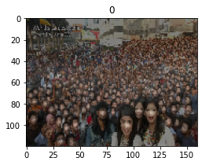
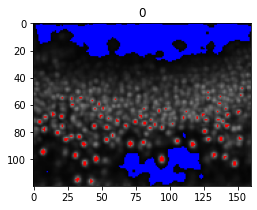
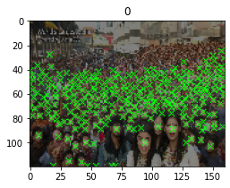
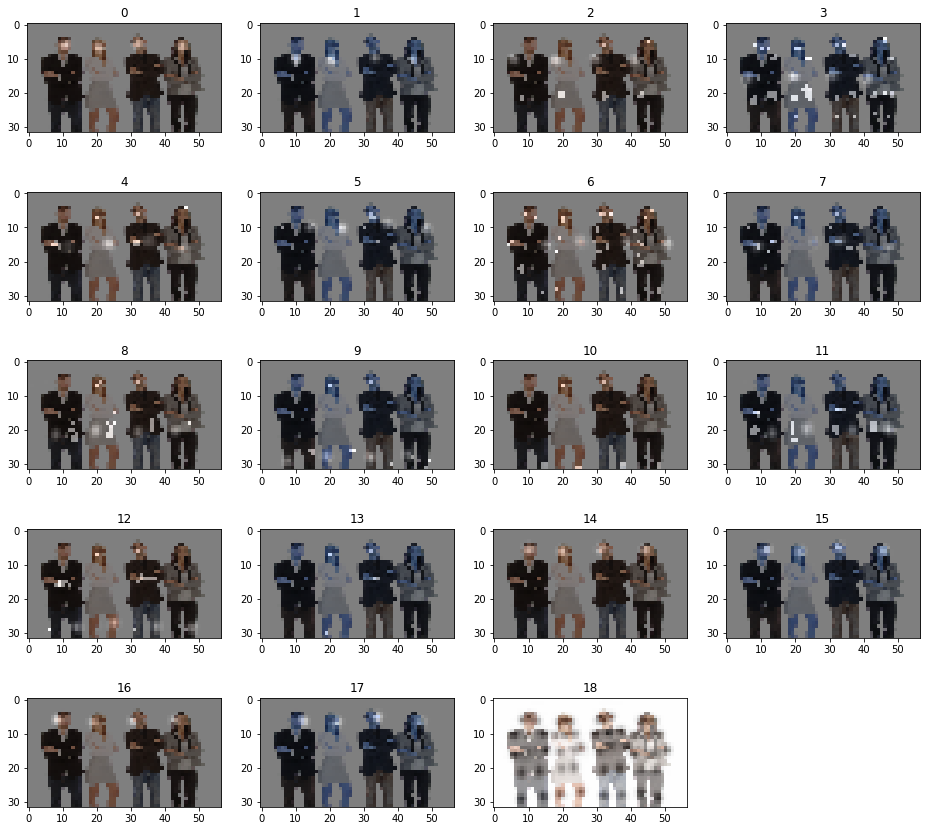
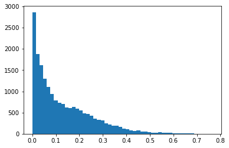

# OpenVINO Model Experiment Package

## 1. Descriptioin
This project provides a set of useful functions to manipulate, analyze, display, and understand the inference result from Intel(R) Distribution of OpenVINO(TM) toolkit.  
The library can be called from an independent Python program or from an Jupyter notebook.  
The library `openvino_model_experiment_package` (`omep`) includes following functions:
 - **OpenVINO simplified API** : model loading, image inferencing, label reading
 - **Common data processing** : normalize, softmax, maxpooling, index sort, BBox NMS, heatmap NMS, Peak detection
 - **Data visualize** : BBox draw, statistics information, histogram, heatmap, classification reult
 - **Model specific data parse** : classification, SSD, YOLO, Centernet

## 2. Example of output

**Bounding box drawing**  
```python
import openvino_model_experiment_package as omep
import cv2
model = 'public/mobilenet-ssd/FP16/mobilenet-ssd'
ie, net, exenet, inblobs, outblobs, inshapes, outshapes = omep.load_IR_model(model)
img_orig = cv2.imread('car_1.bmp')
res = omep.infer_ocv_image(exenet, img_orig, inblobs[0])   # Inference
objs = omep.decode_ssd_result(res[outblobs[0]], threshold=0.8)
omep.display_bboxes(objs, img_orig)
```
  

**Heatmaps (DBFace)**  
```python
import openvino_model_experiment_package as omep
import cv2
model = 'dbface-vga/dbface'
ie, net, exenet, inblobs, outblobs, inshapes, outshapes = omep.load_IR_model(model)
img_orig = cv2.imread('selfie.jpg')
res = omep.infer_ocv_image(exenet, img_orig, inblobs[0]) # Inference
hm = res[outblobs[0]]
omep.display_heatmap(hm)
```
  

**Heatmap on an image**  
```python
import openvino_model_experiment_package as omep
import cv2
model = 'dbface-vga/dbface'
ie, net, exenet, inblobs, outblobs, inshapes, outshapes = omep.load_IR_model(model)
img_orig = cv2.imread('selfie.jpg')
res = omep.infer_ocv_image(exenet, img_orig, inblobs[0]) # Inference
hm = res[outblobs[2]]
omep.display_heatmap(hm, overlay_img=img_orig)
```
  

**Heatmap with highlight and lowlight marking**  
```python
import openvino_model_experiment_package as omep
import cv2
model = 'dbface-vga/dbface'
ie, net, exenet, inblobs, outblobs, inshapes, outshapes = omep.load_IR_model(model)
img_orig = cv2.imread('selfie.jpg')
res = omep.infer_ocv_image(exenet, img_orig, inblobs[0]) # Inference
hm = res[outblobs[2]]
omep.display_heatmap(hm, normalize_flg=True, threshold_l=0.02, threshold_h=0.5)
```
  

**Heatmap with peak markers**  
```python
import openvino_model_experiment_package as omep
import cv2
model = 'dbface-vga/dbface'
ie, net, exenet, inblobs, outblobs, inshapes, outshapes = omep.load_IR_model(model)
img_orig = cv2.imread('selfie.jpg')
res = omep.infer_ocv_image(exenet, img_orig, inblobs[0]) # Inference
hm = res[outblobs[2]]
omep.display_heatmap(hm, overlay_img=img_orig, normalize_flg=True, draw_peaks=True, peak_threshold=0.2)
```
  

**Heatmap from human-pose-estimation-0001 model**  
```python
import openvino_model_experiment_package as omep
import cv2
model = 'intel/human-pose-estimation-0001/FP16/human-pose-estimation-0001'
ie, net, exenet, inblobs, outblobs, inshapes, outshapes = omep.load_IR_model(model)
img_orig = cv2.imread('people.jpg')
res = omep.infer_ocv_image(exenet, img_orig, inblobs[0]) # Inference
omep.display_heatmap(res['Mconv7_stage2_L2'], overlay_img=img_orig, statistics=False)
```
  

**Histogram**  
  
```python
import openvino_model_experiment_package as omep
import cv2
model = 'dbface-vga/dbface'
ie, net, exenet, inblobs, outblobs, inshapes, outshapes = omep.load_IR_model(model)
img_orig = cv2.imread('selfie.jpg')
res = omep.infer_ocv_image(exenet, img_orig, inblobs[0]) # Inference
hm = res[outblobs[2]]
omep.display_histogram(hm, normalize_flg=False)
```

## 3. How to use
Place the `openvino_model_experiment_package.py` to the same directory as the Python project and import it.  
```Python
import openvino_model_experiment_package as omep
```

## 4. API
Refer to the `omep-jupyter-test.ipynb` (or `openvino_model_experiment_package.py`) to learn how to use it.  

## 5. Tested environment
- OpenVINO 2020.3 LTS
- Windows 10 1909
